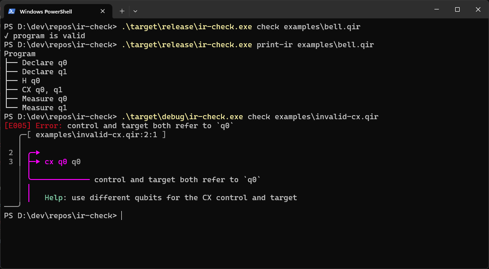

# IR Check

A small Rust compiler-front-end experiment for a minimal quantum circuit DSL, focused on structured diagnostics and developer ergonomics.



## Why I Built This

IR Check explores how a compiler frontend can preserve source attribution, separate semantic analysis from presentation, and provide actionable diagnostics.

The project uses a deliberately small quantum circuit language so the focus stays on compiler and developer-tooling architecture rather than simulation.

## Features

- Minimal quantum circuit DSL
- Rust-based parser
- Structured intermediate representation
- Semantic analysis passes
- Stable compiler error codes
- Source-attributed diagnostics
- Human-readable terminal rendering
- IR inspection through the CLI

## Example

```text
qubit q0
qubit q1

h q0
cx q0 q1

measure q0
measure q1
```

Run:

```bash
cargo run -- check examples/bell.qir
```

Output:

```text
✓ program is valid
```

## Invalid Example

```text
qubit q0

measure q0
h q0
```

The tool reports an `E003` operation-after-measurement diagnostic with source context and remediation guidance.

## CLI

```bash
ir-check check <FILE>
ir-check print-ir <FILE>
```

## Architecture

```text
Source
  ↓
Parser
  ↓
Program IR
  ↓
Semantic Analysis
  ↓
Vec<Diagnostic>
  ↓
Renderer
```

## Language

Supported instructions:

```text
qubit <name>
h <qubit>
x <qubit>
cx <control> <target>
measure <qubit>
```

## Diagnostics

```text
E000 Invalid Syntax
E001 Unknown Qubit
E002 Duplicate Qubit Declaration
E003 Operation After Measurement
E004 Duplicate Measurement
E005 Invalid CX Operands
```

## Design Decisions

### Structured diagnostics

Compiler passes return `Diagnostic` values rather than printing directly. This keeps semantic analysis independent from presentation and makes future consumers such as JSON, Python tooling, notebooks, or an LSP possible.

### Source attribution

IR instructions preserve source spans so errors discovered after parsing can still be mapped back to source code.

### Small analysis passes

Declaration, measurement-state, and operand validation are separate analysis stages.

### Deliberately minimal DSL

IR Check does not simulate quantum state or target hardware. The project is intentionally scoped around compiler-front-end ergonomics.

## Current Limitations

* Source spans are instruction-level rather than operand-level.
* The DSL has no control flow or functions.
* The project performs semantic validation, not quantum simulation.
* Some independent passes may report cascading diagnostics.

## Future Work

* Operand-level source spans
* JSON diagnostic output
* Python bindings
* Notebook integration
* LSP support
* Additional gate definitions
* Circuit visualization
* OpenQASM frontend

## Development

```bash
cargo test
cargo fmt --check
cargo clippy
```